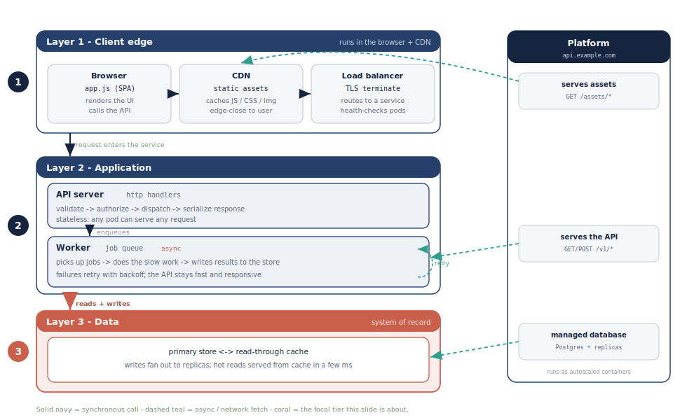

<!-- Worked example deck: a deck ABOUT the deck system, so it doubles as a
     few-shot reference. Theme by name (kb-tech, from assets/themes/). The
     diagram is a HAND-AUTHORED SVG (architecture-layers.svg) sitting next to
     this file and embedded directly with Marp's w: keyword: no build/render
     step, the .svg file IS the source. See
     references/handauthored-svg-diagrams.md for the full convention.
     Build it:  deck build deck-system  -->

<!-- _class: lead -->

# The `deck` System

Author, preview, and render Marp decks from anywhere

---

## What it is

- One global `deck` CLI - no per-project repo needed
- Themes by name (`kb-tech`, `kb-business`, ...) from the shared theme-set
- Decks live in `~/.notes/lab/decks` and ride the notes sync
- Diagrams are **hand-authored SVGs** embedded straight into the slide

---

## A layered diagram



*Hand-authored SVG: transparent canvas, header-barred layer bands, one coral focal tier.*

---

## Why hand-authored SVG

- **The file is the source** - no D2/Mermaid render step, just embed it
- **Diffable + editable** - anyone can nudge a box or fix a label in the `.svg`
- **Theme-neutral** - transparent canvas + white cards read on light OR dark
- **One coral accent** - colour only the single focal node, nothing else

---

## Commands

```bash
deck new talk --theme tech   # scaffold into the deck home
deck watch talk              # live preview at localhost:8088
deck build talk              # render the deck to PDF
deck doctor                  # what's installed on this machine?
```

---

## How to add your own diagram

- Copy `architecture-layers.svg` next to your deck as a template
- Edit the `<rect>`/`<text>`/`<path>` shapes and labels
- Embed it: `` - size with `w:` / `h:`
- Keep the title in the slide `##`, not inside the SVG

---

<!-- _class: lead -->

# Your turn

`deck new <name> --theme tech`
